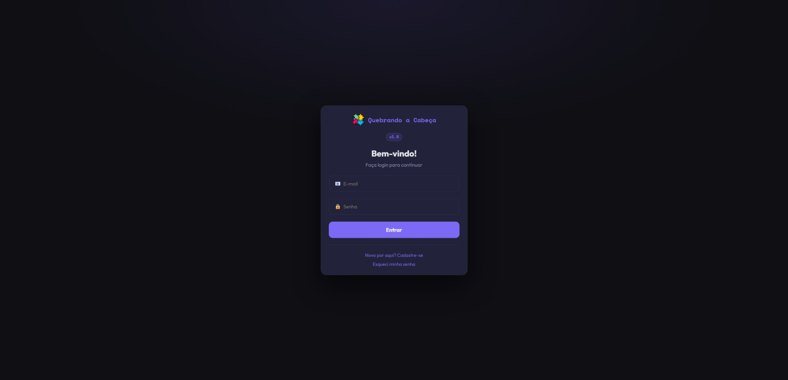

# ♻️ Módulo Reutilização de _Software_

<p style="text-align: center; font-size: 1.5em;">
<strong>Documento de Reutilização de <i>Software</i> </strong> 
</p>

## 1. Introdução

### 1.1 Objetivo

Este documento tem como objetivo descrever a aplicação do princípio da **Reutilização de _Software_** no desenvolvimento do projeto **Quebrando a Cabeça**, focando principalmente em demonstrar, tanto conceitualmente quanto via código, recursos arquiteturais, padrões de design de software estruturados (GoF) e bibliotecas reutilizadas.

### 1.2 Justificativas e Senso Crítico

---

## 2. Reutilização de _Software_ Praticada

### 2.1 Reutilização de _Software_ de Terceiros: Bibliotecas e _Frameworks_

Dois dos principais conceitos empregados em reutilização de código, e que foram ambos empregados neste projeto, são as **bibliotecas** e os **_frameworks_**. Ambos caracterizam-se como seções de código reutilizáveis e geralmente prontas criadas para acelerar o desenvolvimento de _software_ resolvendo problemas e capturando funcionalidades (domínios cognitivos) comuns a várias aplicações.

A principal diferença está no **fluxo de controle**: tirando exceções conceitualmente pontuais, na biblioteca, o código do consumidor geralmente chama as funções dela, e a sua base não dita necessariamente a arquitetura global do programa. No _framework_, é ele que controla o fluxo da aplicação e chama o seu código, o chamado Princípio de Hollywood ou Inversão de Controle (IoC, na sigla em inglês), e também define a arquitetura fixa e o ciclo de vida principal.

#### 2.1.1 _Backend_

- **FastAPI**: Reutilização de _framework_ (caixa-cinza) servidor de processos, abstraindo protocolos de rede puros;
- **SQLAlchemy**: Reutilização de servidor de gerenciamento transacional de banco de dados, poupando a equipe de lidar com sintaxe SQL bruta, assim tanto reduzindo a quantidade de código novo necessária como melhorando a segurança contra eventuais falhas como injeção de SQL.

#### 2.1.2 _Frontend_

- **React Router DOM**: Reaproveitamento de mecânica de navegação SPA (_Single Page Application_) sem necessidade de recarregar a visualização da página por inteiro, permitindo ao usuário navegação mais rápida e atualizações de conteúdo dinâmicas;
- Tipagens do **TypeScript**: Reaproveitamento de interfaces e definições de tipos de dados (como as modelagens em `game.types.ts` e `user.types.ts`) por múltiplos componentes, _hooks_ e chamadas de API, estabelecendo contratos únicos que evitam a reescrita de validações de estrutura de dados ao longo do código-fonte.

### 2.2 Reutilização de Lógica via Padrões de Projeto (_Backend_)

**Padrões de projeto** são elementos arquiteturais menores, mais abstratos e menos especializados do que _frameworks_. Não se manifestam como código por si só, sendo efetivamente uma assistência ou solução puramente conceitual e abstrata que habilita a criação de código de um _framework_.

No _backend_, foram aplicados extensamente padrões de projeto (_design patterns_) do GoF (`backend/app/patterns/`) que viabilizam a reutilização de soluções genéricas para problemas recorrentes.

#### Exemplo: Padrão _Factory_ e _Builder_ para criação de Peças e Dificuldades

- **Conceito:** O padrão _Factory_ permite encapsular a lógica de criação de objetos, enquanto o _Builder_ gerencia instâncias complexas (como a geração do `puzzleboard` respeitando diferentes dificuldades: fácil, médio, difícil). Isso garante que toda regra de fabricação e estruturação fique em uma fonte unificada, evitando a cópia destas lógicas pelos _routers_.
- **Código Comprobatório:** <!--*(Cole aqui um trecho curto do arquivo `backend/app/patterns/factory/factory.py` ou `builder/director.py`, mostrando a fábrica acionando uma classe reutilizada)*.--> _Factory_ da classe abstrata de **dificuldade** de jogo (`Difficulty`) no _backend_, que pode ser Fácil, Média ou Difícil (`Easy`/`Medium`/`Hard`):<br>

```python
def get_difficulty(dto: GetToyDifficultyPayload) -> ResultPayload[Difficulty]:
    """
    Importa e instancia a classe de dificuldade selecionada dinamicamente.
    Args:
        selected_difficulty (str): A dificuldade selecionada.
    Returns:
        Difficulty: A instância da dificuldade selecionada.
    """
    selected_difficulty = dto.difficulty

    try:
        module = importlib.import_module(
            f".{selected_difficulty.lower()}", package=__package__
        )

        class_name = f"{selected_difficulty.capitalize()}Difficulty"
        backend_class = getattr(module, class_name)

        if not issubclass(backend_class, Difficulty):
            raise ValueError(
                f"Class '{class_name}' in '{selected_difficulty}.py' module does not implement Difficulty."
            )

        return ResultPayload(
            success=True, message=["Was able to get difficulty!"], data=backend_class()
        )
    except ImportError:
        return ResultPayload(
            success=False,
            error=[f"Difficulty '{selected_difficulty}' not found."],
        )

    except AttributeError:
        return ResultPayload(
            success=False,
            error=[
                f"Class '{class_name}' not found in '{selected_difficulty}.py' module."
            ],
        )`
```

### 2.3 Componentes base (_Frontend_: `components/common/`)

No desenho de um sistema de _software_, um **componente** é um elemento modular que encapsula funcionalidades específicas atrás de um conjunto de interfaces externas, proporcionando coesão, reuso e robustez no sistema e seu desenvolvimento. Um componente pode ser substituído por outro com as mesmas interfaces e, potencialmente, ter estrutura interna.

Certas bibliotecas e _frameworks_ encorajam a criação e o reuso de componentes de _software_ como um paradigma central de desenvolvimento, a exemplo, dentro do _frontend_ deste próprio projeto, da biblioteca gráfica **React**.

- **Conceito** do Exemplo: Construção de botões, modais e _layouts_ de fundo unificados. A interface herda as propriedades, permitindo chamá-los na página de Login, Jogo ou Configurações sem recriar _layouts_.

- **Código Comprobatório:** Classe `Card` e seu uso na página de Login:

#### `frontend/src/components/common/Card/Card.tsx`:

```typescript
export interface CardProps extends HTMLAttributes<HTMLDivElement> {
  /** Aplica .card-interactive (hover com leve elevação) — usar em cards clicáveis, como seleção de nível/dificuldade. */
  interactive?: boolean;
  children: ReactNode;
}

export function Card({ interactive = false, children, className, ...rest }: CardProps) {
  const classNames = ['card', interactive ? 'card-interactive' : '', className].filter(Boolean).join(' ');

  return (
    <div className={classNames} {...rest}>
      {children}
    </div>
  );
}
```

#### Reuso de `Card` na página `frontend/src/pages/Login/Login.tsx`:

```typescript
<div className="card">

    <div className="logo">
      
      Quebrando a Cabeça
    </div>

    <div className="badge">v1.0</div>

    <div>
      <div className="title">Bem-vindo!</div>
      <div className="sub">Faça login para continuar</div>
    </div>

    {erro && <div className="error-panel">{erro}</div>}

    <input
      className={`field ${senhaErro ? 'error' : ''}`}
      type="email"
      placeholder="📧  E-mail"
      value={email}
      onChange={e => setEmail(e.target.value)}
      disabled={isLoading}
      autoComplete="off"
    />
    <input
      className={`field ${senhaErro ? 'error' : ''}`}
      type="password"
      placeholder="🔒  Senha"
      value={senha}
      onChange={e => setSenha(e.target.value)}
      disabled={isLoading}
      autoComplete="new-password"
    />

    <button
      className="btn btn-primary"
      onClick={handleLogin}
      disabled={isLoading}
    >
      {isLoading ? 'Entrando…' : 'Entrar'}
    </button>

    <div className="divider" />

    <div className="links">
      <span className="link" onClick={() => navigate('/cadastro')}>
        Novo por aqui? Cadastre-se
      </span>
      <span className="link" onClick={() => navigate('/recuperar-senha')}>
        Esqueci minha senha
      </span>
    </div>

</div>
```

#### Demonstração do `Card` na página de Login:



---

## 3. Comentários Gerais sobre o Trabalho em Equipe

_(Detalhar como a equipe atuou na arquitetura de reutilização. Responder coisas como: A equipe conseguiu aplicar reuso com sucesso? Teve muita refatoração para corrigir código repetido para colocar em um componente só? Todos os membros conseguiram alinhar as expectativas com os padrões reutilizáveis adotados?)_

---

## 4. Quadro de Participações e Commits

_(Para cumprir o requisito obrigatório de informar a participação, você tem duas opções: Se atrelar ao documento que você criou "4.3.ParticipacoesArqReutilizacao.md" usando um Hyperlink para ele ou apresentar a tabela aqui mesmo)._

| Membro | Função / Foco na Entrega | Principais Commits ou PRs (Links) | Contribuição para a Reutilização |
| ------ | ------------------------ | --------------------------------- | -------------------------------- |
| [Nome] | Arquiteto Backend        | `[#123](url_do_commit)`           | Modelagem do Builder/Factory     |
| [Nome] | Front-end Engineer       | `[#124](url_do_commit)`           | Componentização da View          |
| João   | Documentação e Revisão   | `[#125](url_do_commit)`           | Estruturação do DAS de Reuso     |

---

## 5. Histórico de Versões

| Data       | Versão | Descrição                                                                                                   | Autor(es)   | Revisor(es)  |
| ---------- | ------ | ----------------------------------------------------------------------------------------------------------- | ----------- | ------------ |
| 20/06/2026 | 1.0    | Criação do roteiro e estrutura inicial; Reutilização de _Software_ de Terceiros: Bibliotecas e _Frameworks_ | João Felipe | João Eduardo |
| 20/06/2026 | 1.1    | Criação da seção sobre padrões de projeto e adição de referência (bibliográfica) a _slides_ da disciplina   | João Felipe | João Eduardo |
| 20/06/2026 | 1.2    | Criação da seção sobre componentes                                                                          | João Felipe | João Eduardo |

---

## 6. Referências:

| #   | Referência                                                                                                                                                                                                                         |
| --- | ---------------------------------------------------------------------------------------------------------------------------------------------------------------------------------------------------------------------------------- |
| 1   | BARRY, D.; STANIENDA, T. **Solving the Java object storage problem**. Computer, v. 31, n. 11, p. 33–40, 1998.                                                                                                                      |
| 2   | **SQL injection prevention - OWASP cheat sheet series**. Disponível em: < https://cheatsheetseries.owasp.org/cheatsheets/SQL_Injection_Prevention_Cheat_Sheet.html >. Acesso em: 19 jun. 2026.                                     |
| 3   | **React Router DOM: como funciona o roteamento em aplicações React**. Disponível em: < https://www.rocketseat.com.br/blog/artigos/post/react-router-dom-guia-completo-roteamento-react >. Acesso em: 19 jun. 2026.                 |
| 4   | WOZNIEWICZ, Brandon; ROSA, Daniel. **A diferença entre um framework e uma biblioteca**. Disponível em: < https://www.freecodecamp.org/portuguese/news/a-diferenca-entre-um-framework-e-uma-biblioteca/ >. Acesso em: 20 jun. 2026. |
| 5   | SERRANO, Milene. **Arquitetura e Desenho de Software - Aula Reutilização & Framework**. Acesso em: 19 jun. 2026.                                                                                                                   |
| 6   | PANDEY, Pankaj. **Tutorial notes: Software Components and Connectors**. Disponível em: < https://medium.com/@publicapplicationcenter/tutorial-notes-software-components-and-connectors-a425bfd984df >. Acesso em: 20 jun. 2026.    |
| 7   | PAULA FILHO, Wilson de Pádua. **Engenharia de software: Produtos – Volume 1**. 4. ed. Rio de Janeiro: LTC, 2019.                                                                                                                   |
| 8   | CONTRIBUINTES DA WIKIPÉDIA. **Software component**. Disponível em: < https://en.wikipedia.org/w/index.php?title=Software_component&oldid=1331598089 >. Acesso em: 20 jun. 2026.                                                    |
